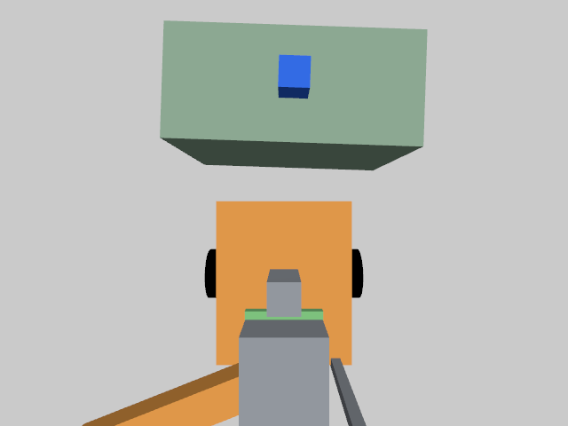

# 003 · 移动机械臂视觉搬运仿真

独立的 ROS 2 + Gazebo 工程：小车去取料台，通过相机寻找蓝色物料，机械臂抓取并装到车载托盘，运到目标台，识别红色放置标记后卸货，最后回到起点。

返航采用“两段式”：Nav2 先返回起点附近，再通过地面的紫红色长方形标记测量位置和方向，完成视觉精对位。这里只用相机测量和正常导航指令，不用仿真真值修正机器人坐标。

**不需要 001 或 002 的文件、地图、启动脚本或运行进程。** 不需要物理机械臂、小车或相机。首版用于验证完整的移动操作闭环，不代表可直接部署到真实机器人。

> 发布状态：首个公开仿真版本。已在下述本机环境完成验证；从空白系统安装依赖的完整步骤和跨机器复现验证尚未完成，后续补充。现阶段不保证克隆后即可直接运行。

实际相机识别画面（不是示意图）：



另见[返航对位相机画面](docs/images/home-aligned-camera.png)和[实测记录与原始证据](docs/validation.md)。

## 首版边界

- 自建差速底盘、四自由度 SCARA 机械臂、双指夹爪、托盘和俯视 RGB 相机。
- Nav2 + AMCL 负责底盘定位和导航；近距离抓放使用实际相机图像重新定位。
- 视觉使用颜色标记、相机内参和已知水平桌面高度，不是通用物体检测、深度感知或任意姿态抓取。
- 返航标记是有长短边的矩形，方向估计存在 180° 对称性；因此精对位以前，粗导航必须已经大致朝向起点规定方向。
- 机械臂采用解析逆运动学及“升高—平移—下降”的受限动作，不是 MoveIt 全场景碰撞规划。只验证本工程设计的工作台场景，不允许任意改目标或在机械臂工作区加障碍物。
- **辅助抓取**：物体接近夹爪、夹爪闭合且底盘停止时，Gazebo 才创建固定刚体约束；托盘运输使用近距离货物固定约束。这不是接触摩擦夹持。夹爪手指只显示几何，不用虚假摩擦参数包装效果。
- 不用修改物体坐标模拟搬运。仿真真实位姿仅用于抓取约束判定、停车检查及结果验收；视觉定位不读取物体真实坐标，导航不读取底盘真实坐标。
- 首版单个物料、单次任务；再次运行会启动新场景。不包含 002 的电池或任务队列功能。

## 已适配环境

当前 WSL Ubuntu 中的 ROS 2 Lyrical、Gazebo Sim 10.4，以及 `/opt/nav2` 导航安装。

系统依赖包括：`rclpy`、`ros_gz_bridge`、`robot_state_publisher`、`tf2_ros`、`cv_bridge`、Nav2（AMCL、NavFn、Regulated Pure Pursuit 等）、RViz、OpenCV、NumPy、PyYAML、pytest、CMake、C++ 编译器和 Gazebo 开发库。

这属于系统软件依赖，不是对历史项目的依赖。暂未验证 Humble/Jazzy 等其他发行版；不要直接混装不同 ROS/Gazebo 版本。

## 启动

以下命令假设系统依赖已安装。在 WSL 中进入本仓库的项目目录（将 `/path/to/robotics` 替换为你的仓库位置）：

```bash
cd /path/to/robotics/projects/03-mobile-manipulator
bash run_demo.sh
```

脚本会生成本工程模型与地图、构建插件、启动 Gazebo/RViz/Nav2，并自动执行一次任务。首次 CMake 配置可能需要几分钟。不要手动发 Nav2 Goal 干预正在运行的任务。

本机实测：无界面约 2 分 37 秒，带 Gazebo/RViz 窗口约 5 分 45 秒；具体耗时取决于仿真速度和图形性能。最终带界面全流程、取消停车测试和 28 项自动测试已通过，详情见实测记录。

RViz 默认用 `Map (compatible geometry)` 显示真实 `/map` 数据，避免本机传统地图纹理着色器的兼容报错。传统 `Map` 显示保留但默认关闭；导航仍正常使用原始 OccupancyGrid 地图。

观察顺序：去取料台 → 相机识别 → 抓取 → 装上托盘 → 导航运输 → 识别目标标记 → 卸货 → 回到起点。

任务结束后仿真保留，便于检查。`Ctrl+C` 关闭本次启动的进程；不会全局杀掉其他 ROS/Gazebo 工程。

## 测试和诊断

```bash
# 不启动仿真的单元测试
bash scripts/test.sh

# 检查系统依赖（只检查，不自动安装或修改系统）
bash scripts/doctor.sh

# 无界面真实仿真；结束后自动退出
MM_HEADLESS=1 MM_AUTO_EXIT=1 bash run_demo.sh

# 自动启动新场景，在导航中取消任务并验证停车
bash scripts/test_integration.sh cancel

# 只启动场景、相机和导航，不执行任务
MM_DIAGNOSTIC_ONLY=1 bash run_demo.sh
```

另一个终端查看状态或取消任务：

```bash
cd /path/to/robotics/projects/03-mobile-manipulator
source scripts/env.sh
ros2 topic echo /mm/status
# 需要取消时：
ros2 service call /mission/cancel std_srvs/srv/Trigger
```

取消/异常时底盘停止，不自动释放正在夹持的货物。任务停止后重新启动演示，不在未知状态下自动继续。

默认 `ROS_DOMAIN_ID=43`，`GZ_PARTITION=mobile_manipulator_003`；每个辅助终端必须先 source 本工程环境。只有需要隔离多个实例时才设置 `MM_DOMAIN_ID`、`MM_GZ_PARTITION`，并在所有相关终端保持一致。

## 验收依据

每次运行使用独立目录：

- `logs/<run-id>/`：构建、Gazebo、ROS/Nav2 和任务日志。
- `reports/<run-id>/mission.json`：阶段、失败原因、真实位姿验收和最终状态。
- 同一报告目录中的 PNG：实际相机检测画面。

查看最近一次任务摘要：`python3 tools/report_summary.py`。

只有抓起、托盘装载、随车运输、目标台放置、返航检查全部通过才标记 `COMPLETED`。例如找不到目标、目标超出工作空间、导航失败、关节超时，都应该停下并产生 `FAILED` 报告，而不是忽略失败继续任务。

底盘速度有独立的关闭式联锁：任务允许行驶、心跳新鲜且机械臂已经收拢时，导航速度才能转发。任务进程退出或心跳断开后，输出零速度。这是仿真联锁，**不是工业安全认证功能**。

## 目录

```text
03-mobile-manipulator/
├── run_demo.sh              # 一键仿真与任务
├── config/                 # 导航、任务、桥接、RViz
├── launch/                 # 本工程 ROS 启动
├── description/            # 生成的机器人 URDF
├── worlds/                 # 生成的独立场景
├── maps/                   # 本场景静态导航地图
├── src/mobile_manipulator/ # 运动学、视觉、任务、速度联锁
├── src/plugins/            # Gazebo 抓取/托盘物理约束
├── tools/                  # 可复现的模型/地图生成器
├── scripts/                # 环境、构建、测试
├── tests/                  # 自动测试
└── docs/                   # 架构及实测记录
```

模型和地图由 `tools/generate_assets.py` 生成；修改源生成器后再启动，不要只改生成文件。用户任务配置在 `config/mission.yaml`。大幅调整工作台高度、相机或机械臂尺寸时，必须同步修改运动学、视觉标定和验收设置。

## 许可证

本项目代码遵循仓库根目录的 [Apache License 2.0](../../LICENSE)，原创文档遵循 [CC BY 4.0](../../docs/LICENSE.md)。ROS 2、Nav2、Gazebo 等外部依赖仍遵循其各自许可证。
