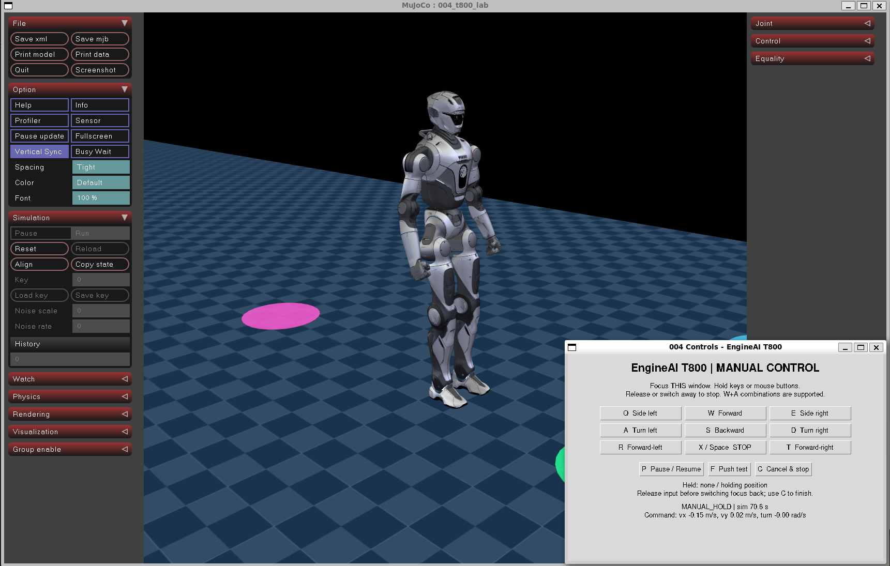
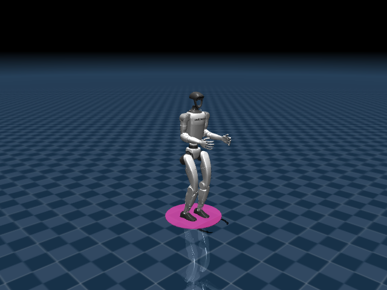
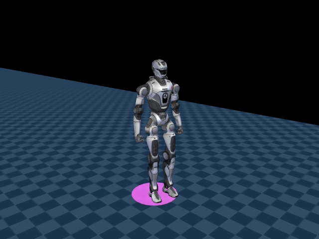

# 004 · 人形机器人运动控制与行走验证

独立的 **MuJoCo + 人形机器人预训练步态**工程，支持 **宇树 Unitree G1 / 众擎 EngineAI T800**。机器人通过关节力矩与地面接触完成前进、转向、定点行走和位置保持；支持受控取消、推力实验、跌倒检测及逐次报告。

**不依赖 001～003，不需要实物，不需要 ROS 2 / Gazebo，也不需要从零训练策略。** 当前项目是仿真控制与验证工具，不是可以直接部署到真机的控制软件。



2026-09-07：本机用户已确认修复后手动操作正常，上图为实际运行截图。当前为本机验证的仿真演示版本；跨机器全新安装复现尚未验收。





## 切换机器人

先按下文安装所需模型，再选择机器人运行，关闭后可切换；**不是运行中换皮，也不是让 T800 使用 G1 的策略**。无参数命令启动 G1。

```bash
# 在克隆后的 robotics/projects/04-humanoid-locomotion 目录执行
bash run_demo.sh --robot g1
bash run_demo.sh --robot t800

# 手动控制 T800（按键说明与 G1 一致）
bash run_demo.sh --robot t800 --mode manual
```

| 选项 | G1 | T800 |
| --- | --- | --- |
| 官方模型 | 12 个腿部活动关节，上身固定 | SDK 的 25 关节串联模型 |
| 预训练策略 | 12 维动作，PyTorch | 22 维动作，MNN；腰部/头部由 PD 保持 |
| 步态推理频率 | 50 Hz | 100 Hz |
| 输入 | 47 维 | 72 维 × 15 帧历史 + 3 维指令 |
| 资源清单 | `assets/manifest.json` | `assets/manifest-t800.json` |

T800 并非 T800 Pro，也不代表所有商品版本。机械臂随步态参与控制，但没有抓取任务。

## 能做什么

- `route`：HOME → A(3,0) → B(3,2) → HOME(0,0)，各点连续保持位置与朝向 10 秒。
- `stand`：初始区域动态位置保持，连续验收 30 秒。
- `manual`：键盘前进、后退、转向、侧移、弧线行走，输入过期后减速并保持位置。
- `push`：仿真第 8 秒对骨盆施加指定世界坐标方向推力，记录完成或跌倒。
- `baseline`：只发送速度指令，测量原始策略表现，**不做位置保持补偿**。
- 图形窗口状态显示、无界面批量测试、CSV 轨迹、JSON 报告与结果图。

## 必须了解的边界

1. **步态不是本项目训练的。** G1 使用 Unitree RL Gym，T800 使用 EngineAI Native SDK 的模型与权重，来源与版本见 [第三方说明](THIRD_PARTY_NOTICES.md)。本项目开发的是控制封装、任务反馈、交互、实验与验收。
2. 两个模型的活动关节和策略不同，见上表；均不提供双臂抓取或灵巧手操作。
3. **任务层使用 MuJoCo 真值定位。** 位置保持、定点到达和验收使用仿真位姿，不声称实现了 SLAM、视觉定位、实物状态估计或避障。
4. **零速度不保证位置不变。** G1 零指令下会踏步并漂移；T800 本机零指令漂移较小，但不保证绝对静止。`stand`、到点保持、手动松键保持及取消保持使用理想定位反馈补偿，不是固定基座或锁定坐标。
5. **停止不等于关电机。** 正常取消继续运行平衡控制，先减速再保持；退出窗口/Ctrl+C 是终止仿真，不算验证了实物停车。
6. 不修改运行中的根部坐标，不固定基座，不用吊绳或动画伪造平衡。只有一次试验开始前设置初始位姿。发生跌倒后终止试验，不自动重置掩盖失败。
7. 仅验证开放平地；不含上下楼、跑跳、起身、障碍物导航、抓取搬运、实物控制或安全认证。不同时间/方向/接触阶段的推力不能直接相互比较。

## 当前环境

已在本机 WSL2 / WSLg、Ubuntu 26.04 LTS 中进行开发。项目使用独立的 Python 3.12.13、MuJoCo 3.3.6、PyTorch 2.7.1+cpu；系统 ROS 使用的 Python 不变。

策略推理与物理仿真使用 CPU。图形显示可使用 GPU。本机原先默认 llvmpipe 软件渲染很慢，启动脚本仅为当前进程选择已有的 WSL D3D12 驱动，不安装驱动、不改系统配置。

## 安装

需要 `git` 和 `uv`，图形模式需要可用的 OpenGL 显示环境。新机器先按 [uv 官方说明](https://docs.astral.sh/uv/getting-started/installation/)安装 uv。

首次获取（已有仓库时直接进入项目目录，不要重复克隆）：

```bash
git clone https://github.com/zephastra/robotics.git
cd robotics/projects/04-humanoid-locomotion
```

后续命令均在上述项目目录执行。开发机原目录为 `~/projects/004_humanoid_locomotion`；代码按自身位置定位资源，无需复制或重命名工程。

```bash
# 在项目目录执行
bash scripts/setup.sh
bash scripts/doctor.sh
```

安装脚本会建立 `.venv`，下载 Python 和指定依赖，然后下载固定提交的官方模型和策略。需要网络；本机虚拟环境约 0.9 GB，模型约 25 MB，下载缓存另外占空间。不要在运行任务时重新执行安装脚本。

新机器额外安装 T800（G1 不需要此步骤）：

```bash
bash scripts/setup_t800.sh
bash scripts/doctor.sh --robot t800
```

T800 使用固定版本 `MNN==3.6.1`，CPU 推理，不需要安装完整众擎 SDK、Docker 或 Isaac Lab。安装器只读取 SDK 的模型、配置和权重，不启动硬件服务。资源单独下载、校验并保留 BSD 许可，不使用赛事专用资源。

本机 glibc 2.43 拒绝加载 MNN wheel 的可执行栈请求。安装器使用项目内 `patchelf==0.19.1.0` 清除此标记，原件与变更哈希备份到 `.cache/mnn-stack-backup/`；不启用可执行栈、不改系统库、不改 uv 缓存。详见 [双机器人适配说明](docs/robots.md)。

`requirements.txt` 固定直接依赖，`requirements-lock.txt` 记录本机完整 Python 依赖基线；模型、权重和配置由 `assets/manifest.json` 记录哈希，每次启动都会校验。CUDA、Isaac Gym 和训练工具不是本项目运行依赖。

## 运行

### 自动行走（默认）

```bash
# 在项目目录执行
bash run_demo.sh
```

机器人依次到达 A、B、HOME，完成后输出报告并关闭窗口。黄色球表示当前目标，地面色块表示到达区域。终端显示阶段进度，手动模式的独立控制面板显示状态、仿真时间及速度。为解决真实桌面的窗口阻塞，已移除自定义文字叠加层；旧路线截图中的叠加文字不代表当前界面。

```bash
# 动态位置保持
bash run_demo.sh --mode stand

# 手动操作
bash run_demo.sh --mode manual

# 有限推力实验（单位 N，持续时间单位秒）
bash run_demo.sh --mode push --push-force 30 --push-duration 0.2

# 无界面自动行走；尽快运算，不等待现实时间
bash run_demo.sh --headless

# 对比原始零速度策略；完成只表示没有跌倒并运行到指定时间
bash run_demo.sh --mode baseline --headless --duration 30
```

**2026-09-07 手动控制修复：请点击新弹出的 `004 Controls - EngineAI T800`（或 G1）控制窗口，再按住 W。不是终端，也不是 MuJoCo 仿真窗口。** 原启动命令不变。等待至少 2 秒仿真时间后，可按住方向键或用鼠标按住窗口里的方向按钮；支持 W+A 等组合键。

控制窗口直接记录按下/松开，按住期间持续提供指令，不再依赖操作系统连发。松键、鼠标离开方向按钮、窗口失去焦点会撤销移动指令，然后按原有加速度限制减速与保持。暂停/停止后需松开并重新按键；若在窗口外松键，回到窗口后可先按下再松开一次以解除该键的防误恢复锁定。控制窗口每 20 ms 刷新心跳，超过 0.5 秒未更新的指令会在控制循环读取时过期；整个主线程阻塞时不能保证执行停车，这不是独立的实物安全看门狗。

控制面板显示当前按键、仿真时间及实际下发的速度指令。终端和仿真窗口的 W/S 等移动键已禁用，避免多个输入来源冲突；仍可用 C 取消、X 停止。终端的方向键转义序列不会再被误识别为 C。

| 按键 | 动作 |
| --- | --- |
| W / S | 前进 / 后退 |
| A / D | 左转 / 右转 |
| Q / E | 向左 / 向右侧移 |
| R / T | 向前同时左转 / 右转 |
| X 或空格 | 停止移动并保持位置（手动模式） |
| C | 取消任务，减速、保持并检验停止结果 |
| P | 暂停/继续物理仿真；不是机器人停车 |
| F | 施加一次当前配置的推力 |

自动任务中 W/S 等手动速度不会接管任务；需要停止请按 **C**。不要在 MuJoCo 自带面板重置仿真或修改状态；检测到时钟重置时本工程会终止该次试验。

如果图形驱动不兼容，可测试软件渲染（速度可能很慢）：

```bash
H004_RENDERER=software bash run_demo.sh
```

`H004_RENDERER=auto` 为默认；`d3d12` 可显式选择 WSL 驱动，`H004_GPU_ADAPTER` 可指定适配器名称。选择仅作用于此命令及子进程。

## 测试与结果

本机已完成 53 项自动测试（含 5 项需图形环境的控制窗口测试；普通测试默认跳过这些图形项）。新增真实 Tk 事件 + MuJoCo 物理循环的持续前进、松键与取消停车集成测试，见 [手动控制修复记录](docs/manual-controls.md)。此前 G1 与 T800 均完成 20/20 次有限初始扰动路线测试、4/4 次取消停车及带界面完整路线；手动输入修改后进行了两种模型的路线回归，移除文字叠加调用后又通过 T800 双窗口集成测试。这些结果不是实物成功率或精度承诺。

```bash
bash scripts/test.sh
.venv/bin/python scripts/batch.py --suite route --count 20
.venv/bin/python scripts/batch.py --suite baseline
.venv/bin/python scripts/batch.py --suite cancel
.venv/bin/python scripts/batch.py --suite push

# 同一验收流程，使用 T800（不指定 --robot 时为 G1）
.venv/bin/python scripts/batch.py --robot t800 --suite route --count 20
.venv/bin/python scripts/batch.py --robot t800 --suite baseline
.venv/bin/python scripts/batch.py --robot t800 --suite cancel
```

批量测试使用独立进程和新场景；保留每一次结果。路线批量测试对初始 xy 做 ±0.04 m、朝向做 ±0.08 rad 的有限变化；这不是对所有环境的泛化测试。

单次结果位于 `reports/<UTC运行编号>/`：

- `report.json`：结果、配置、源代码/策略哈希、目标验收、扰动信息。
- `trajectory.csv`：仿真时间、位姿、速度、倾角、指令与阶段。
- `summary.png`：实际轨迹、身体倾角和速度曲线。
- `final-camera.png`：使用 `--snapshot` 时保存的实际仿真渲染。

详细验证结果见 [G1 实测记录](docs/validation.md) 与 [T800 实测记录](docs/validation-t800.md)。任务验收条件定义于 `config/lab.yaml`；模型专属控制周期与跌倒高度定义于 `robots.py`（T800 基座更高），程序不会为通过测试而自动放宽阈值。失败、超时和跌倒不会被标成任务完成。基线的 `COMPLETED` 只表示跑满时长；批量基线额外检查各方向的实际位移/转角。

## 目录与许可

`src/humanoid004/` 是本项目控制与验证逻辑；`config/` 是任务配置；`scripts/` 是安装/诊断/测试工具；`assets/` 与 `policies/` 保存按版本获取的第三方资源；`docs/` 是架构和实测说明。

原创代码使用 [Apache-2.0](LICENSE)。第三方模型、策略及派生代码保留原有许可，详见 [THIRD_PARTY_NOTICES.md](THIRD_PARTY_NOTICES.md)。
