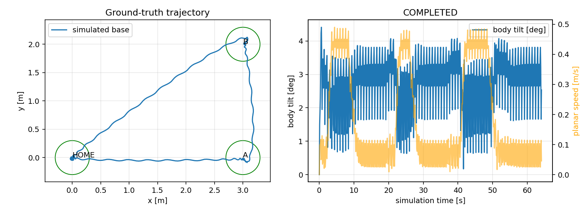

# 本机仿真实测记录

日期：2026-09-06（北京时间；原始运行编号使用 UTC）。环境：WSL2/WSLg、Ubuntu 26.04、Python 3.12.13、MuJoCo 3.3.6、PyTorch 2.7.1+cpu。

## 自动路线

自动检查：`bash scripts/test.sh` 实测 **30 passed**，覆盖角度/坐标变换、指令限幅与平滑、输入超时、连续到达判定、保持速度阈值、跌倒去抖、模型和关节匹配、资源校验、独立性、按键逻辑及伪终端输入/终端恢复。`scripts/doctor.sh` 检查通过，安装脚本重复执行检查通过。

不同初始条件共 20 次，完成 20 次。仿真用时范围 64.08～64.22 秒；完成案例最终位置误差范围 2.34～2.54 cm。

条件：初始 xy 分别在 ±0.04 m、yaw 在 ±0.08 rad 内变化，其余模型、平地环境和控制参数固定。此统计不代表真实机器人可靠性。

[批量概要](evidence/route-summary.json)；逐次完整报告在 `evidence/route/`，包含配置、源代码哈希和策略哈希。

## 图形界面完整任务

结果 `COMPLETED`，仿真时间 64.16 秒，墙钟时间 255.44 秒，最终位置误差 2.34 cm。运行时还存在并行批量测试，耗时不是性能基准。

[完整报告](evidence/gui-route.json)

## 原始策略与动态位置保持

原始零速度模式只评价是否运行至指定时长，`COMPLETED` 不代表没有漂移。零速度策略会踏步，位置保持依赖任务层的理想定位反馈。

闭环保持测试完成 30.02 秒连续保持，最终位置误差 3.11 cm。

| 基线 | 最终平面位移 m | 累计转向 deg | 结果 |
| --- | ---: | ---: | --- |
| zero | 0.710 | -16.2 | COMPLETED |
| stand | 0.031 | -0.4 | COMPLETED |
| forward | 3.615 | -8.1 | COMPLETED |
| backward | 0.919 | -5.0 | COMPLETED |
| left | 0.202 | 206.0 | COMPLETED |
| right | 0.209 | -217.2 | COMPLETED |
| side_left | 0.690 | -5.0 | COMPLETED |
| side_right | 1.141 | -6.6 | COMPLETED |

[基线详细证据](evidence/baseline-summary.json)

## 取消停车

仿真第 0、8、30、45 秒请求取消：4/4 通过。先减速 3 秒，再进行 10 秒闭环位置保持验收。

[取消详细证据](evidence/cancel-summary.json)

## 有限推力实验

相同初始状态，仿真第 8 秒向骨盆施加世界坐标 +Y 方向外力，持续 0.2 秒。下表每种强度仅测试一次，不能据此声称精确的抗推阈值。

| 外力 | 结果 | 原因 |
| --- | --- | --- |
| push-10N | COMPLETED | 完成路线 |
| push-30N | COMPLETED | 完成路线 |
| push-60N | COMPLETED | 完成路线 |
| push-100N | COMPLETED | 完成路线 |
| push-150N | COMPLETED | 完成路线 |
| push-250N | FAILED | FALL_DETECTED |
| push-400N | FAILED | FALL_DETECTED |
| push-800N | FAILED | FALL_DETECTED |

[扰动详细证据（包含失败）](evidence/push-summary.json)

## 已知限制

- 固定/合并上身的 12 关节腿部模型，不是全身操作。
- 仿真真值参与定位与保持，不含实物估计误差。
- 不含复杂地形、避障、跌倒起身、实物部署或安全认证。
- WSL 默认软件渲染曾出现严重低速；项目启动器局部选择已有 D3D12 驱动。
- 批量测试为无界面；另有一次带界面的全路线测试。尚不将人工键盘操作称为经过人工验收。
