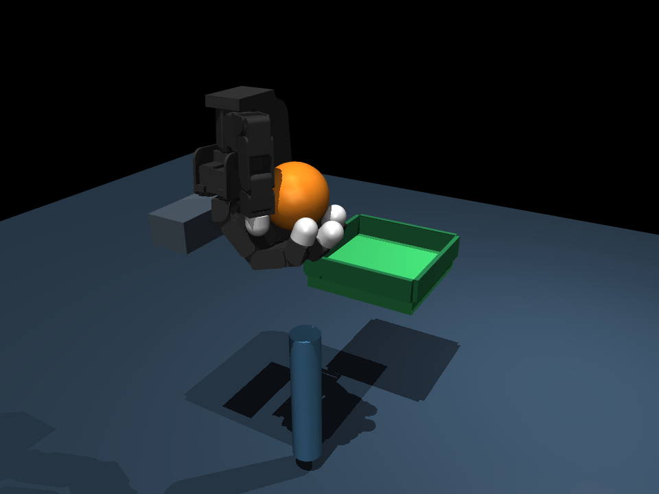
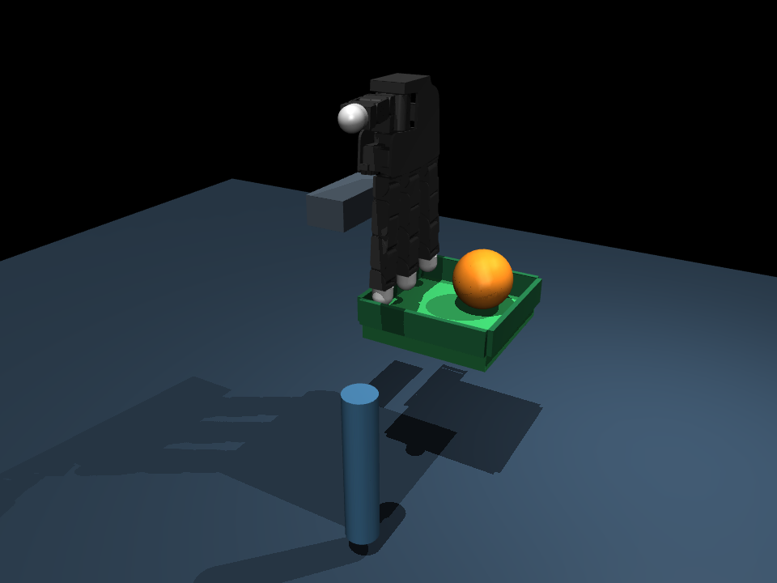

# 005 · 灵巧手动作与接触抓取实验台

独立的 **MuJoCo + Allegro Hand V3** 仿真工程。重点是手部动作、手指接触和抓取验证，不依赖 001～004，不需要实物、ROS、训练权重或机器人硬件 SDK。

**当前是四指灵巧手实验台，不是完整人形机器人。** 手腕安装在有明确关节和驱动器的两轴定位夹具上；夹具负责抬升和横移，不声称实现了机械臂规划或站立平衡。





## 第一版已经包含

- 4 根手指、16 个独立关节滑块；张开、包络姿态和捏合姿态预设。
- 两轴手腕夹具控制：Y 横移、Z 抬升。
- 自动任务：张开 → 合拢 → 接触确认 → 抬起 → 保持 → 横移 → 放开并撤手 → 放置验收。
- 自由物体与真实仿真接触，不使用吸附、绑定、焊接约束或运行中修改物体坐标。
- 各手指法向接触力显示、失败判定、CSV 轨迹和 JSON 报告。

捏合按钮目前仅用于观察拇指与食指动作，**尚未验收独立的两指捏取任务**。完整自动任务使用已标定的多指包络姿态，不是通用抓取策略。

## 从 GitHub 安装

在 Linux / WSL 中克隆仓库，然后按照下方“独立安装”准备依赖：

```bash
git clone https://github.com/zephastra/robotics.git
cd robotics/projects/05-dexterous-hand
bash scripts/setup.sh
bash run_demo.sh --mode demo
```

项目使用相对自身目录的资源路径，不要求位于 `~/projects/005_dexterous_hand`。全新机器复现仍待验收。

## 快速开始（本机 WSL）

```bash
cd ~/projects/005_dexterous_hand

# 自动完成一轮抓取、抬升、转移、释放，结束后退出
bash run_demo.sh --mode demo

# 手部操作面板：默认模式
bash run_demo.sh
```

点击 **005 Hand Controls** 控制窗口，不是在 MuJoCo 窗口按住 W。

| 控件 | 功能 |
| --- | --- |
| Index / Middle / Ring / Thumb 的 J0～J3 | 单独设置每根手指的关节目标，单位 rad |
| 1 Open | 张开手指 |
| 2 Power pose | 多指包络姿态 |
| 3 Pinch pose | 两指动作预设，非已验证捏取 |
| Y transfer / Z lift | 两轴实验夹具位置，单位 m |
| Run grasp demo | 从源位置开始自动验收，物体不在源位置时拒绝开始 |
| Cancel demo / hold | 中止自动任务并保持当前关节位置；不是断电 |
| Pause / resume | 暂停/恢复物理仿真；不是实物停车 |
| Quit / 关闭窗口 / Ctrl+C | 结束本次仿真并保存报告 |

**关节滑块是持续位置目标，不是按住移动键。** 点击后保持目标，失去焦点不清空；目标以速度限制平滑下发。手动操作可以使物体掉落，程序不会自动把球放回去。重新开始一轮请关闭后重新运行。自动任务期间操作滑块或姿态按钮会中止任务并接管手部目标，不会继续把被干预的任务算作成功。

自动结束后希望保留窗口：

```bash
bash run_demo.sh --mode demo --keep-open
```

## 独立安装

已在 WSL2 / WSLg、Ubuntu 26.04、Python 3.12.13、MuJoCo 3.3.6 中验证。全新机器复现尚未验收。

需要 `git`、[uv](https://docs.astral.sh/uv/getting-started/installation/) 和图形模式所需的 OpenGL 显示。进入本工程目录后：

```bash
bash scripts/setup.sh
bash scripts/doctor.sh
```

安装器创建本工程自己的 `.venv`，从固定提交获取 Menagerie 的 Allegro 模型，只读取模型和许可，不执行上游机器人控制程序。不会访问 004 的虚拟环境或资源。直接依赖固定在 `requirements.txt`；资源清单和哈希保存到 `assets/manifest.json`，运行前校验。

手动面板需要 Tk；安装器所选的独立 Python 在本机包含 Tk 9.0。诊断脚本会检查 Tk 导入、模型和物理步进，但不替代真实鼠标测试。

WSLg 下启动脚本仅为当前进程选择已有 D3D12 渲染器；软件渲染可用：

```bash
H005_RENDERER=software bash run_demo.sh
```

## 验收标准

自动任务不是仅按时间播放动画。阶段转换使用仿真测量值；不满足条件时保存 `FAILED`。

- 合拢后：拇指和至少另外两根手指的物体接触法向力均大于 0.02 N，连续保持 0.5 秒。
- 抬升后：球相对初始位置上升至少 9 cm，脱离源支座；夹具命令抬升 12 cm。
- 保持：持续 2 秒，球相对手掌的位移不超过 2 cm。
- 转移期间：失去要求的多指接触超过 0.5 秒时失败。
- 放置：球心在目标中心 x/y 各 ±3.5 cm 内，球心高度约 20.5 cm（±1.2 cm）；托盘接触成立、手指接触力和低于 0.02 N、球速低于 0.02 m/s，连续 1 秒。
- 物体低于 10 cm、非有限状态、外部重置仿真时钟或任务超时不会算成功。

绿色区域是带挡边的接收托盘。当前球半径 35 mm、质量 50 g；球使用六维接触，托盘设定滚动摩擦长度为 0.001 m，用于名义接收垫建模。**这些是明确设定的仿真接触参数，未经实物材料标定。** 手指关节、质量、碰撞几何和位置驱动器来自上游，没有为抓取扩大手指关节范围。

## 测试与记录

```bash
bash scripts/test.sh

# 五次独立初始化，初始 x/y 各 ±2 mm 的有限变化
.venv/bin/python scripts/batch.py --count 5 --offset 0.002

# 无界面自动任务
bash run_demo.sh --mode demo --headless

# 可用 EGL 的机器可额外保存阶段渲染
MUJOCO_GL=egl bash run_demo.sh --mode demo --headless --snapshot
```

当前 14 项测试通过，包含完整物理任务；五个初始偏差试验 5/5 通过。**只涵盖同一种球、质量、姿态和有限偏差，不代表泛化成功率。** 开发过程中曾出现滚落、手指支撑未释放、放置不稳定等失败；保留原始报告，不把失败改写为通过。

归档证据：[名义任务报告](docs/evidence/nominal-report.json)、[五次有限偏差试验](docs/evidence/batch-final.json)、[图形测试](docs/evidence/gui-verification.json)、[图形会话完整报告](docs/evidence/gui-report.json)。修改释放轨迹前的 [3/5 试验](docs/evidence/batch-before-release-fix.json) 和 [仅改变托盘摩擦的 0/5 试验](docs/evidence/batch-pad-only.json) 也保留作为调试记录；不是当前版本的验收成绩。

`reports/<UTC编号>/report.json` 保存会话结果、各次任务结果、事件、资源/源代码哈希和最终接触测量；`trajectory.csv` 保存球轨迹与分指接触力。手动会话退出可以为 `CANCELLED`，其中已经完成的自动任务仍保存在 `trials` 中。`--snapshot` 保存保持、完成或失败时的实际渲染。

图形开发测试为 `GALLIUM_DRIVER=d3d12 .venv/bin/python scripts/verify_gui.py`：程序调用实际 Tk 按钮并运行 MuJoCo 窗口，**不等于人工通过 Windows 鼠标的最终验收**。不调用曾在 004 中阻塞的 `viewer.set_texts()`；状态文字放在独立控制窗口。

## 边界与下一步

当前使用已知物体位置和仿真接触力，不包含视觉识别、真实触觉传感器、学习策略、五指人手、手内旋转、双手协作或完整人形站立操作。硬件不可直接使用本工程的控制参数。

下一步优先验收两指捏取、小物体与不同尺寸，然后增加传感反馈自适应合拢；最后再讨论机械臂/人形躯干集成，而不是直接复用 004 的行走策略控制手臂。

## 目录与许可

`src/hand005/`：控制、任务状态机、模型测量和面板；`scripts/`：安装、诊断与测试；`assets/`：准备后的模型及清单；`reports/`：本地运行结果。

原创代码采用 [Apache-2.0](LICENSE)。Allegro 模型采用 BSD-2-Clause，完整来源及改动见 [第三方说明](THIRD_PARTY_NOTICES.md)。
