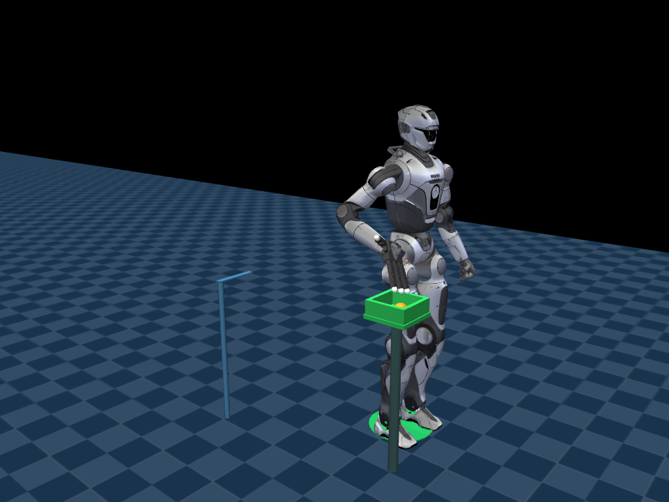

# 006 — Humanoid grasp, carry, and placement

An independent MuJoCo experiment integrating an EngineAI T800 walking policy
with a rigidly mounted, articulated Allegro right hand. It does **not** import
or require projects 001–005. This is simulation research, not hardware-ready
control or a manufacturer-supported robot configuration.

Current validation: **3/3 bounded transport cases passed**, standing lift passed,
12 automated checks passed, and GUI pause/resume/cancel callbacks passed.



## Task

Stand → reach → establish opposed finger contacts → lift → hold → walk roughly
one meter → stop → lower → release into a receiving tray → withdraw the hand →
verify placement.

The initial scenario is intentionally bounded: one 50 g sphere of radius 35 mm,
known source/target coordinates, level ground, and a fixed receiving tray. The
task reads simulator state directly; it does not use vision or plan around
obstacles. A tray is required for this spherical object; arbitrary flat-table
placement is not demonstrated.

## Install from GitHub

With the prerequisites under “First-time setup” installed, run in Linux/WSL:

```bash
git clone https://github.com/zephastra/robotics.git
cd robotics/projects/06-humanoid-transport
bash scripts/setup.sh
bash run_demo.sh --mode transport --keep-open
```

Resource paths are relative to the project itself; the original local folder
name is not required. Fresh-machine reproduction remains unverified.

## Run in WSL

Existing prepared installation:

```bash
cd ~/projects/006_humanoid_transport
bash run_demo.sh --mode transport --keep-open
```

The separate **006 Simulation Controls** window provides Pause/Resume and
Cancel. Cancel freezes and ends the simulated task; it is not a controlled
hardware emergency stop. Closing the MuJoCo window also ends the task. The
result remains frozen with `--keep-open` until a window is closed.

Standing grasp/lift only:

```bash
bash run_demo.sh --mode lift --keep-open
```

Headless validation and snapshot:

```bash
MUJOCO_GL=egl bash run_demo.sh --mode transport --headless --snapshot
.venv/bin/python -m pytest -q
```

Every run saves `reports/<UTC timestamp>/report.json`: outcome, failure reason,
phase transitions, sampled payload/contact measurements, final state, source
hashes, and asset hashes. Success exits 0; cancellation, timeout, and failure
exit nonzero. Failed runs are retained. A screenshot alone is not acceptance.

## First-time setup

Requires Linux/WSL2, Git, uv, graphics support for MuJoCo (WSLg for the GUI), and
network access for the pinned upstream assets and dependencies. The project
uses its own Python 3.12 environment.

```bash
cd ~/projects/006_humanoid_transport
bash scripts/setup.sh
```

Setup downloads fixed upstream revisions, retains licenses, and generates the
combined model. On affected MNN builds, the setup script clears an executable
stack flag on a **private copy inside this project's virtual environment**;
it preserves a backup and does not patch system packages.

After editing `config/mission.json`, regenerate the model/asset manifest:

```bash
.venv/bin/python scripts/prepare_model.py
```

Configuration changes are experiments, not guaranteed working alternatives.

## Control and acceptance

- The pretrained walking network receives actual robot joint observations.
- The right arm transitions to position IK plus joint PD/bias compensation;
  the remaining robot joints retain the original walking controller.
- The hand uses joint-position control. The adapter has no added wrist motor.
- Physics runs at 500 Hz; walking inference runs at 100 Hz.
- Payload motion comes from contacts and gravity: no payload weld, mocap,
  per-step pose overwrite, or fixed floating base.
- Grasp establishment requires thumb and two other finger contacts. Retention
  also checks hand-local slip, allowing normal contact load redistribution.
- Carry alignment includes a calibrated 35 mm lateral settling compensation.
  This is specific to this setup, not a general locomotion controller.
- Placement requires actual tray-floor contact, no significant finger load,
  low object speed, target height, and horizontal error below 60 mm, sustained
  for one second. It is not accepted merely because the hand opens.

## Limitations

This does not train a unified whole-body policy, implement whole-body
optimization, demonstrate heavy loads, handle arbitrary objects, or prove
robustness on hardware. Arm IK is position-only and is not a collision-aware
planner. The original walking policy was not trained for this added hand or
payload. The right-hand adapter is an experimental model modification, not
an official T800 hand option. See [validation notes](docs/VALIDATION.md) for
tested outcomes and known failures.

## Layout

```text
config/       Mission and pinned robot/controller configuration
src/          Independent runtime, task logic, and GUI/CLI entry point
scripts/      Setup, model assembly, and developer probes
tests/        Acceptance-logic and model checks
licenses/     Upstream license texts
assets/       Generated models, meshes, and provenance manifests
policies/     Downloaded pretrained walking policy
reports/      Local run evidence (not source-controlled)
```

See [third-party notices](THIRD_PARTY_NOTICES.md). Downloaded assets and policy
weights are obtained by setup and are not bundled in this source release.
