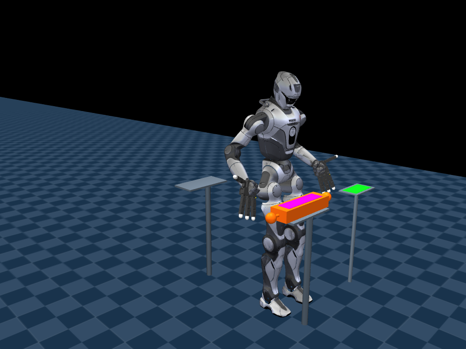

# 007 — 主动视觉与人形机器人双手搬运

> **实验性开发快照，不是已完成的稳定版本。** 2026-09-18 发布前复核：
> 当前快照 57 项自动测试通过；未重跑完整物理批测。最新保存的针对性案例仍有
> CARRY 超时和工作台接触。完成项与未完成项见 [发布核对](docs/RELEASE_AUDIT.md)。

从 GitHub 安装（Linux / WSL2）：

```bash
git clone https://github.com/zephastra/robotics.git
cd robotics/projects/07-humanoid-visual-transport
bash scripts/setup.sh
bash run_demo.sh --mode vision --keep-open
```

完整搬运是实验任务，不保证默认场景或任意偏移成功。

独立的 MuJoCo 仿真实验：T800 人形机器人、左右 Allegro 手、随头部运动的
RGB-D 摄像头，以及带抓握把手的轻量箱体。无需运行或安装 004、005、006 工程。

## 实现范围与历史进度

已完成完整视觉搬运：观察定位、双手抓取抬升、分段行走、停稳复核、
协调放置、撤手和独立物理验收。第一版代码通过默认 GUI 场景及两个位置变化场景，
当时另有 21 项自动测试和暂停/继续/取消回调检查通过。
这些是有限场景验收，不是通用可靠性证明。
详细结果见 [验证记录](docs/VALIDATION.md)。

第二阶段已经启动：第一版基线已归档，新增 30 组可重复测试和有次数限制的中间路点恢复。
上一轮路点修复后的完整 30 组测试均完成搬运，但其中 25 组仍有工作台接触记录。
测试结果、恢复条件和已知工作台接触问题见
[第二阶段记录](docs/STAGE2.md)。**完成搬运不等于全程无碰撞，第二阶段尚未全部完成。**

本轮增加自动抓取/放置站位、接近减速及逐物理步的接触力诊断。
默认启用 `--stance auto`，`--stance legacy` 保留旧流程用于对照。
实现范围、命令与验收结果见 [自动站位里程碑](docs/STANCE_PLANNING.md)。
仍使用已知工作台几何和限定通路，并未加入通用障碍绕行。
**自动站位仍是开发版本，尚未通过完整回归。** 下文第一版的演示和通过记录不能视为当前开发版的保证。



## 运行

```bash
cd ~/projects/007_humanoid_visual_transport
# 主动观察与定位
bash run_demo.sh --mode vision --keep-open
# 视觉定位后双手抓取、抬升
bash run_demo.sh --mode lift --keep-open
# 完整搬运实验
bash run_demo.sh --mode transport --keep-open
```

独立控制窗口显示仿真头部摄像头的实际图像，并提供暂停、继续和取消按钮。
取消/关闭窗口会冻结并结束仿真，不代表硬件上的受控急停。

改变初始位置（这些范围只是输入限制，不是已经验证的成功范围）：

```bash
bash run_demo.sh --mode vision --box-offset 0.02 0.01 --box-yaw 5 --keep-open
bash run_demo.sh --mode transport --target-offset 0.05 0.03 --keep-open
```

第一版曾验证的完整位置变化组合（当前开发版需重新回归）：

```bash
bash run_demo.sh --box-offset 0.02 0.01 --target-offset 0.05 0.03 --keep-open
bash run_demo.sh --box-offset -0.02 -0.01 --target-offset -0.05 -0.03 --keep-open
```

以上偏移单位为米。第一版单独验收的偏航变化覆盖视觉定位与抬升；第二阶段把
固定种子的 ±5° 范围偏航样例纳入完整搬运测试，具体结果以第二阶段记录为准。

无界面测试和报告：

```bash
MUJOCO_GL=egl bash run_demo.sh --headless --snapshot
.venv/bin/python -m pytest -q
```

每次运行保存到 `reports/<UTC时间>/`，包含阶段记录、头部角度、双手接触、视觉估计、
独立真值评估、代码与资产哈希。失败报告同样保留。成功退出码为 0，失败、取消、
超时返回非零。`--snapshot` 保存阶段摄像头图像和最终场景截图。

## 首次安装

需要 Linux/WSL2、Git、uv，以及 MuJoCo 所需图形支持；GUI 使用 WSLg。

```bash
bash scripts/setup.sh
```

脚本创建本工程自己的 Python 3.12 虚拟环境，获取固定版本上游模型与策略。
如 MNN 扩展带有不必要的可执行栈标记，只处理本工程环境内的独立副本，并保留备份，
不修改系统环境或其他工程。

修改场景或任务配置后重新生成资产清单：

```bash
.venv/bin/python scripts/prepare_model.py
```

## 信息边界

- `vision.py`：只接收 RGB、深度、相机标定、相机位姿与时间戳。
  不接收物体名称、仿真分割 ID、物体真值位姿或场景坐标。
- `camera.py`：头部摄像头传感器适配。相机外参来自机器人的仿真运动学，尚未模拟
  里程计漂移、标定误差或深度噪声。
- `task.py`：从视觉估计生成目标，结合机器人本体状态和接触信息执行任务。
- `tactile.py`：理想化接触传感器，提供左右手负载以及工作台承重信息，不提供物体位姿。
- `app.py`：初始化场景变化并独立评估结果。真值只写入报告和用于验收，不回传任务决策。

## 第一版边界

这不是通用目标识别：箱体带紫色矩形视觉标记，接收台配有侧置绿色标记；标记识别采用
RGB 颜色筛选与深度平面估计，没有使用仿真分割标签。已知箱体尺寸和把手间距。

接收标记与实际放置中心相隔 0.75 m，使用工装的已知几何关系换算放置位置。
这样避免箱子挡住台面后无从重新定位。机器人停下后先转头观察标记，再看箱子；
两次观察之间显式假设工作台静止，不宣称能够追踪搬运过程中的动态目标台。
图像处理会拒绝画面边缘裁剪、无效深度和明显非平面数据，并过滤抗锯齿边界；
这不是对所有部分遮挡的通用识别解决方案。

机器人自身的仿真关节/基座状态用于控制与相机外参，因此本项目尚不包含视觉 SLAM。
放置结果必须同时通过实际工作台接触、双手脱离、箱体位置和低速度验收。

箱体主体 150 g，含双侧把手与连接杆共 210 g。双手采用实验性刚性转接件安装，
不是厂商官方 T800 手部配置。头部有真实俯仰和偏航关节，没有增加可动眼球。
摄像头安装时向下倾斜 35°，头部控制遵守原关节限位并限制转动速度。

行走复用上游预训练策略，双臂采用位置 IK 与关节控制。不是重新训练的全身策略，
不是通用全身优化器，不保证任意姿态、物体、负载或真实硬件可用。
工作台之间采用限定场景的分段通路，不是通用障碍物规划器。

箱体保持自由刚体，靠真实接触搬运：无焊接绑定、无固定机器人底座、无运行中物体瞬移。

## 开发诊断

`scripts/probe_bimanual.py` 使用已知坐标隔离检查机械与控制集成。
它被明确标记为真值辅助诊断，不是视觉自主任务，也不参与视觉成功率统计。

上游来源和许可证见 [第三方声明](THIRD_PARTY_NOTICES.md)。
